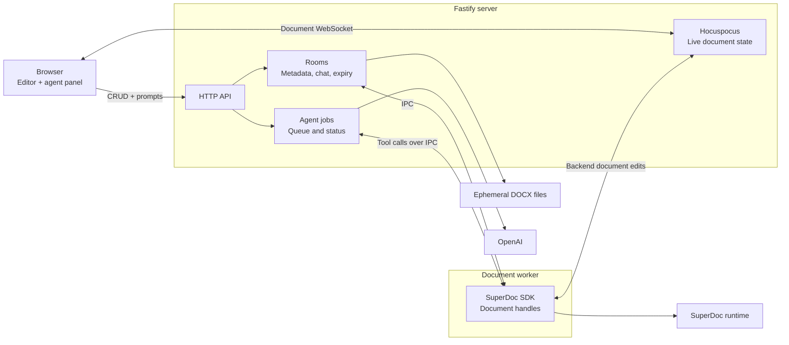

# SuperDoc canonical collaboration demo

A small reference application showing a browser user and a server-side Node agent editing the same SuperDoc document. Everything runs locally, and model requests go directly to OpenAI with your API key.



The browser owns the UI and interactive editor. Fastify owns the API, rooms, chat, expiry, jobs, and collaboration state. The document worker owns the backend SDK client and open document handles, while its SuperDoc runtime descendants perform document processing. The filesystem holds temporary DOCX source and export files.

## Quick start

Prerequisites:

- Node.js 22 or newer
- `make`
- An OpenAI API key

From this directory:

```bash
cp .env.example .env
```

Add your key to `.env`:

```dotenv
OPENAI_API_KEY=your-key-here
```

Start the complete stack:

```bash
make dev
```

All service logs are shown by default. Filter them with either launcher form:

```bash
node scripts/dev.mjs --log documentworker
make dev LOG=documentworker
```

`--log` accepts `all`, `api`, `rooms`, `worker`, `agent`, `documentworker`, `collab`, `client`, or `dev`. Use commas for multiple selections, such as `--log api,collab`. The `worker` selection refers to agent-job lifecycle logs; `documentworker` refers to SDK document operations and memory profiling.

The first run installs the Node dependencies. Open [http://localhost:15173](http://localhost:15173). Press Ctrl-C once to stop both processes. The `.env` file is ignored by Git.

## Use the browser application

The client creates a random room ID and adds it to the URL as `?room=...`. Keep or share that URL to reconnect to the same room while the local services remain running.

1. Open the **File** menu.
2. Choose **New Document** for a blank document or **Upload Document** to import a `.docx` file.
3. Edit the document directly in SuperDoc.
4. Enter an instruction in the agent panel and select **Run agent**. Enter submits; Shift+Enter adds a new line.
5. While a job is running, select **Stop agent** to cancel remaining work. Edits already applied before cancellation are not rolled back.
6. Use **Save As** to export the collaborative document, or **Delete Document** to remove it.

A room contains one document with one stable document ID. Creating or uploading another document calls the Node SDK's `replaceFile()` on the existing backend document session. This atomically resets the shared content without replacing the collaboration identity. Replacement starts a new metadata generation and clears the previous chat history.

The chat panel is isolated in `client/src/components/ChatPanel.tsx`. It communicates only through the public HTTP API and can be replaced with another agent interface.

## Services and ports

`make dev` starts:

| Service | Default address | Responsibility |
| --- | --- | --- |
| React client | `http://localhost:15173` | SuperDoc editor, file controls, and replaceable chat UI |
| Fastify server | `http://localhost:8000` | HTTP API, OpenAI orchestration, agent-job queue, room metadata, and Hocuspocus collaboration |
| Document worker | Child process using IPC | One shared Node SDK runtime and all active backend document sessions |
| Hocuspocus endpoint | `ws://localhost:8000/collaboration` | Live document synchronization between the browser and backend runtime |
| Room-events endpoint | `ws://localhost:8000/api/rooms/{roomId}/events` | Document creation, replacement metadata, and deletion notifications |

The Fastify process owns the ephemeral room registry, source files, activity timestamps, conversation history, agent-job queue, and job records. Hocuspocus owns the live collaborative state inside that process. A separate document-worker process owns one shared `SuperDocClient` and multiple document handles. The API sends individual open, replace, tool-dispatch, save, and close operations to it over Node IPC. This keeps agent-job lifecycle state out of the worker while allowing API replacement and agent editing without an open browser.

Document content travels through Hocuspocus. The room-events WebSocket carries only lifecycle metadata, so the client does not poll room state. Job status is still polled while a submitted job is active because it is an asynchronous task status API, not document synchronization.

## Configuration

| Variable | Default | Purpose |
| --- | --- | --- |
| `OPENAI_API_KEY` | required | Credential sent directly to OpenAI |
| `OPENAI_MODEL` | `gpt-5-mini` | Model used by the document agent |
| `ROOM_TTL_SECONDS` | `3600` | Room expiry period since its last recorded activity |
| `COMPLETED_JOB_TTL_SECONDS` | `600` | Retention period for terminal job records |
| `DOCUMENT_WORKER_MEMORY_SAMPLE_MS` | `5000` | Interval for document-worker memory samples; minimum 1000 ms |

Local service URLs and ports are configured in `scripts/dev.mjs`.

## HTTP API

Room IDs must contain 1–100 letters, numbers, underscores, or hyphens.

| Method | Path | Behavior |
| --- | --- | --- |
| `GET` | `/api/health` | Check server health |
| `GET` | `/api/rooms/{roomId}` | Read room state; returns `document: null` when empty |
| `POST` | `/api/rooms/{roomId}/document` | Create or replace with a blank document |
| `PUT` | `/api/rooms/{roomId}/document` | Upload or replace with a `.docx` file |
| `GET` | `/api/rooms/{roomId}/document` | Export and download the current collaborative DOCX |
| `GET` | `/api/rooms/{roomId}/document/info` | Read document and collaboration metadata |
| `PATCH` | `/api/rooms/{roomId}/document` | Dispatch one SuperDoc toolkit operation through the backend SDK |
| `DELETE` | `/api/rooms/{roomId}/document` | Delete the document and room state |
| `POST` | `/api/rooms/{roomId}/activity` | Refresh activity for a specific document generation |
| `GET` | `/api/rooms/{roomId}/chat` | Read completed agent conversation messages |
| `POST` | `/api/rooms/{roomId}/jobs` | Enqueue an agent prompt |
| `GET` | `/api/rooms/{roomId}/jobs/{jobId}` | Read job status and result |
| `DELETE` | `/api/rooms/{roomId}/jobs/{jobId}` | Cancel a queued or running job |

### End-to-end API example

Create a blank document:

```bash
curl -X POST http://localhost:8000/api/rooms/demo-room/document
```

Add an agent job:

```bash
curl -i -X POST http://localhost:8000/api/rooms/demo-room/jobs \
  -H 'Content-Type: application/json' \
  -d '{"prompt":"Add a heading named Project Overview followed by a short introductory paragraph.","isSuggesting":true}'
```

The response is `202 Accepted`. Copy the generated `id` from the response body or use the URL in the `Location` header.

Read the job status:

```bash
curl http://localhost:8000/api/rooms/demo-room/jobs/job_RETURNED_ID
```

Repeat until `status` is `completed`, `failed`, or `cancelled`. Then download the modified document:

```bash
curl -o modified-document.docx \
  http://localhost:8000/api/rooms/demo-room/document
```

### Replace the document without changing its ID

```bash
curl -X PUT http://localhost:8000/api/rooms/demo-room/document \
  -F 'file=@./example.docx'
```

Uploads must be non-empty `.docx` files no larger than 25 MB. If the room already exists, the response increments `generation` while retaining the same `document_id`. Replacement is rejected while an agent job is active.

### Dispatch a SuperDoc operation directly

`PATCH /document` bypasses the model and dispatches a SuperDoc toolkit operation on the same backend document handle:

```bash
curl -X PATCH http://localhost:8000/api/rooms/demo-room/document \
  -H 'Content-Type: application/json' \
  -d '{"tool":"superdoc_perform_action","arguments":{"action":"insert_heading","text":"Executive Summary","level":1,"placement":{"at":"document_start"}}}'
```

Set `isSuggesting` to `true` for tracked agent changes or `false` for direct edits. Prompts use the completed conversation history for the current document. Job IDs are generated by the server and cannot be supplied by clients.

## Verify collaboration

1. Create or upload a document in the browser.
2. Make a manual edit.
3. Ask the agent to make a distinct edit and confirm it appears in the editor.
4. Replace the document through `curl` and confirm the open editor resets without changing the document ID or reloading the page.
5. Choose **Save As** and confirm the exported DOCX includes subsequent browser and agent edits.
6. Close the browser, enqueue another job through the API, then reopen the same room URL and confirm the backend edit is present.

Structured diagnostics appear in the `make dev` terminal with `[api]`, `[rooms]`, `[worker]`, `[agent]`, `[document-worker]`, `[collab]`, and `[dev]` prefixes. General backend events report the Fastify process memory. The document worker logs `operation.started`, `operation.completed`, or `operation.failed` for every SDK operation, including its duration and active-document count.

Document-worker logs separate the worker process from its SuperDoc runtime descendants:

```text
[document-worker] service.ready pid:12345 documents:0 workerRssMB:91.5 runtimeRssMB:124.8 totalRssMB:216.3
[document-worker] memory.sample documents:1 workerRssMB:94.5 runtimeRssMB:195.5 totalRssMB:290.0
```

`workerRssMB` is the resident memory of the Node document-worker process. `runtimeRssMB` is the combined resident memory of its SuperDoc runtime descendants. `totalRssMB` is their sum. Logs cover the zero-document baseline, periodic samples, every operation boundary, completed collaboration sync, file replacement, document close, and worker shutdown. Multiple documents share the same worker and SDK runtime, so the operating system cannot provide exact per-document attribution.

### Document-worker memory profiler

The repeatable profiler lives in `profiling/document-worker/`. It starts a fresh server for every trial, uploads copies of one DOCX according to the configured lifecycle, samples worker/runtime/total RSS at every state, and then generates a three-panel SVG chart.

Configure the workload in `profiling/document-worker/profile.config.mjs`:

- `trials` controls the default number of fresh-process trials.
- Sampling and settling durations control how many idle readings are collected and how long the runtime settles.
- `operations` is the ordered workload. Each entry names the chart phase, expected open-document count, and an `open`, `close`, or `sample` action. Open and close actions use matching numeric `slot` values.

Run the configured profile with any DOCX:

```bash
make profile DOC=/absolute/path/to/document.docx
```

Override only the trial count without editing the configuration:

```bash
make profile DOC=/absolute/path/to/document.docx TRIALS=25
```

Outputs are written to `profiling/document-worker/results/memory-trials.csv` and `memory-by-state.svg`. The results directory is ignored because RSS measurements are machine- and workload-specific. To regenerate the chart from an existing CSV, run `make profile-chart`.

## Ephemeral state and expiry

- A room holds one document and one conversation.
- Replacement retains the document ID, increments its generation, and clears its conversation.
- Terminal job records expire after 10 minutes by default.
- Rooms expire after one hour without browser, API, collaboration, or agent activity by default.
- The browser sends an activity heartbeat every 30 seconds while a document is open.
- Cleanup runs once per minute, so removal can occur up to roughly one minute after the deadline.
- Active jobs prevent room expiry.
- Process restart recovery is deliberately unsupported; room, collaboration, chat, and job state are in memory.

## Code map

- Fastify and Hocuspocus lifecycle, HTTP routes, service composition, and room events: `server/src/server.js`
- Room metadata, source files, replacement coordination, export, and expiry: `server/src/rooms.js`
- API-side IPC client for document operations: `server/src/document-worker-client.js`
- Multi-document SDK runtime and per-operation memory logging: `server/src/document-worker-process.js`
- OpenAI calls, system prompt, and SuperDoc tool dispatch: `server/src/agent.js`
- In-memory queue, cancellation, and job state: `server/src/jobs.js`
- Browser API and room-events clients: `client/src/api.ts`
- Replaceable agent UI: `client/src/components/ChatPanel.tsx`
- SuperDoc editor: `client/src/components/DocumentEditor.tsx`
- One-command launcher: `scripts/dev.mjs`
- Repeatable document-worker memory benchmark: `profiling/document-worker/profile.mjs`
- Memory benchmark workload and trial configuration: `profiling/document-worker/profile.config.mjs`

## Production boundary

This demo packages a runnable local collaboration topology; it is not a production deployment template. A production owner would still need authentication and authorization, secrets management, durable document and job storage, queue recovery, collaboration persistence, horizontal scaling, rate limits, observability, backups, TLS, and deployment-specific CORS and public URLs.

Kyra can replace the chat component and agent orchestration while retaining the HTTP document surface and SuperDoc collaboration connection. They would operate this Node service or an equivalent implementation preserving the synchronization and state contracts.
