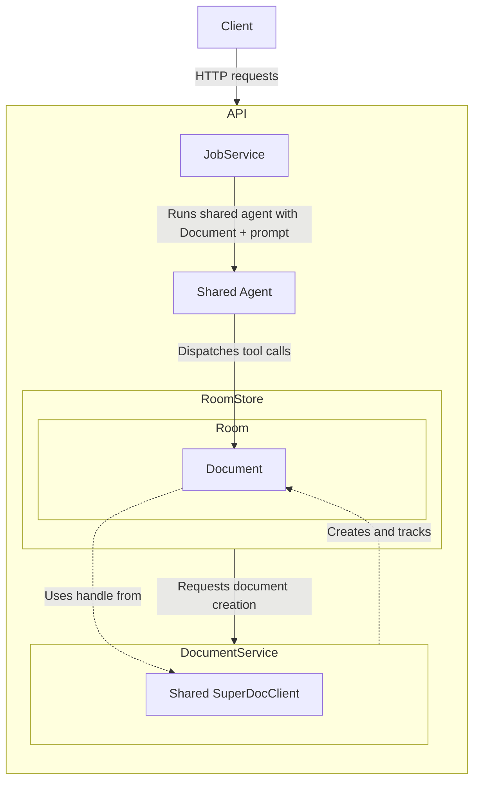

# SuperDoc canonical collaboration demo

A small reference application showing a browser user and a server-side Node agent editing the same SuperDoc document. Everything runs locally, and model requests go directly to OpenAI with your API key.

## Control Diagram/Hierarchy



The diagram focuses on actions initiated through the HTTP API, such as creating, uploading, downloading, replacing, or deleting a document; submitting or cancelling an agent job; reading job or chat state; and checking room status. Separately, SuperDoc manages the client's connection to the document through the Hocuspocus WebSocket endpoint. That connection carries live document edits between browser editors and the backend SDK.

The browser owns the UI and interactive editor. Fastify owns the API, rooms, chat, expiry, jobs, collaboration state, and document service. Each room owns one document object, while the document service owns the shared SDK client. The filesystem holds temporary DOCX source and export files.

### Document Upload/Room Creation

When the client creates a blank document or uploads a DOCX, the server performs this sequence:

1. `RoomStore` writes the blank or uploaded DOCX to the ephemeral document directory.
2. `RoomStore` asks `DocumentService` to open the file.
3. `DocumentService` uses its shared `SuperDocClient` to open an SDK document handle.
4. The SDK handle connects to Hocuspocus using the room ID as the document ID and seeds the collaboration state from the DOCX.
5. `DocumentService` creates a `Document` containing the SDK handle, document ID, filename, file path, and generation number.
6. `RoomStore` creates a `Room` that owns the `Document`.
7. The API returns the document metadata and collaboration URL.
8. The browser initializes SuperDoc with that metadata and connects to the same Hocuspocus document.
9. Hocuspocus synchronizes the seeded document state into the browser editor.

After initialization, live document edits travel through Hocuspocus. The source DOCX is not rewritten after every edit. When the document is downloaded, `Document.save()` exports the current SDK state to a temporary DOCX file.

### Prompt Submission/Job Creation

Submitting a prompt creates an asynchronous agent job. The agent applies document edits during its tool-call loop rather than waiting until the job is complete:

1. The client posts the prompt and Reviewing/Editing mode to the API.
2. `JobService` validates the room, creates and queues a server-generated job record, and immediately returns `202 Accepted` with its job ID.
3. When the job reaches the front of the queue, `JobService` calls the shared agent's `run()` method with the room's `Document`.
4. The agent runs its OpenAI tool-call loop.
5. For each document tool call, the agent calls `Document.dispatch()`.
6. The `Document` applies the operation through its SDK handle.
7. The SDK sends the change through Hocuspocus, which synchronizes it to connected browsers.
8. While this work runs, the client polls the job endpoint and observes `queued`, `running`, and eventually a terminal status.
9. When the agent finishes, it returns its textual answer to `JobService` and appends the prompt and answer to the room's conversation.
10. `JobService` marks the job complete, updates the room activity timestamp, and decrements the room's active-job count.

The agent does not communicate with `RoomStore` directly. Document edits go through the room's `Document`; `JobService` manages room access, job status, cancellation, and completion.

## Quick start

Prerequisites:

- Node.js 22 or newer
- `make`
- An OpenAI API key

From this directory:

```bash
cp .env.example .env
```

Add your key to `.env`:

```dotenv
OPENAI_API_KEY=your-key-here
```

Start the complete stack:

```bash
make dev
```

All service logs are shown by default. Filter them with either launcher form:

```bash
node scripts/dev.mjs --log documentservice
make dev LOG=documentservice
```

`--log` accepts `all`, `api`, `rooms`, `worker`, `agent`, `documentservice`, `collab`, `client`, or `dev`. Use commas for multiple selections, such as `--log api,collab`. The `worker` selection refers to agent-job lifecycle logs; `documentservice` refers to SDK document operations.

The first run installs the Node dependencies. Open [http://localhost:15173](http://localhost:15173). Press Ctrl-C once to stop both processes. The `.env` file is ignored by Git.

## Use the browser application

The client creates a random room ID and adds it to the URL as `?room=...`. Keep or share that URL to reconnect to the same room while the local services remain running.

1. Open the **File** menu.
2. Choose **New Document** for a blank document or **Upload Document** to import a `.docx` file.
3. Edit the document directly in SuperDoc.
4. Enter an instruction in the agent panel and select **Run agent**. Enter submits; Shift+Enter adds a new line.
5. While a job is running, select **Stop agent** to cancel remaining work. Edits already applied before cancellation are not rolled back.
6. Use **Save As** to export the collaborative document, or **Delete Document** to remove it.

A room contains one document with one stable document ID. Creating or uploading another document calls the Node SDK's `replaceFile()` on the existing backend document session. This atomically resets the shared content without replacing the collaboration identity. Replacement starts a new metadata generation and clears the previous chat history.

The chat panel is isolated in `client/src/components/ChatPanel.tsx`. It communicates only through the public HTTP API and can be replaced with another agent interface.

## Services and ports

`make dev` starts:

| Service | Default address | Responsibility |
| --- | --- | --- |
| React client | `http://localhost:15173` | SuperDoc editor, file controls, and replaceable chat UI |
| Fastify server | `http://localhost:8000` | HTTP API, OpenAI orchestration, agent-job queue, room metadata, and Hocuspocus collaboration |
| Document service | Inside the Fastify process | One shared Node SDK client and all active backend document objects |
| Hocuspocus endpoint | `ws://localhost:8000/collaboration` | Live document synchronization between the browser and backend runtime |

The Fastify process owns the ephemeral room registry, source files, activity timestamps, conversation history, agent-job queue, job records, and one shared `SuperDocClient`. Each room owns a `Document` object containing its metadata and SDK handle. `DocumentService` creates these objects and owns shared SDK startup and shutdown. `RoomStore` may request `Document.close()` during deletion or expiry, but it does not perform SDK operations itself.

Document content travels through Hocuspocus. The browser posts to the room status endpoint every 30 seconds to refresh activity and reconcile lifecycle metadata. Replacement content still arrives immediately through collaboration; metadata changes and deletion are detected by the next status request. Job status is polled separately while a submitted job is active because it is an asynchronous task status API.

## Configuration

| Variable | Default | Purpose |
| --- | --- | --- |
| `OPENAI_API_KEY` | required | Credential sent directly to OpenAI |
| `OPENAI_MODEL` | `gpt-5-mini` | Model used by the document agent |
| `ROOM_TTL_SECONDS` | `3600` | Room expiry period since its last recorded activity |
| `COMPLETED_JOB_TTL_SECONDS` | `600` | Retention period for terminal job records |
| `CLIENT_ORIGINS` | Local client URLs and `https://demos.superdoc.dev` | Comma-separated browser origins allowed by CORS |

Local service URLs and ports are configured in `scripts/dev.mjs`.

## Deployment

The shared demos release workflow builds the client with a relative asset base and publishes it to [https://demos.superdoc.dev/collab/](https://demos.superdoc.dev/collab/). The production build reads the backend origin from the GitHub Actions variable `COLLAB_API_URL`, falling back to the canonical Railway domain.

The same production workflow deploys `server/` to Railway and then verifies `/api/health` before publishing the frontend. It requires these GitHub Actions secrets:

- `RAILWAY_TOKEN`: a project-scoped Railway token for the production environment
- `RAILWAY_SERVICE_ID`: the target Railway service ID

The Railway service owns runtime configuration, including `OPENAI_API_KEY` and `PUBLIC_ORIGIN`. Set `PUBLIC_ORIGIN` to the service's HTTPS Railway domain without a trailing slash.

## HTTP API

Room IDs must contain 1–100 letters, numbers, underscores, or hyphens.

| Method | Path | Behavior |
| --- | --- | --- |
| `GET` | `/api/health` | Check server health |
| `GET` | `/api/rooms/{roomId}` | Read room state; returns `document: null` when empty |
| `POST` | `/api/rooms/{roomId}/document` | Create or replace with a blank document |
| `PUT` | `/api/rooms/{roomId}/document` | Upload or replace with a `.docx` file |
| `GET` | `/api/rooms/{roomId}/document` | Export and download the current collaborative DOCX |
| `GET` | `/api/rooms/{roomId}/document/info` | Read document and collaboration metadata |
| `PATCH` | `/api/rooms/{roomId}/document` | Dispatch one SuperDoc toolkit operation through the backend SDK |
| `DELETE` | `/api/rooms/{roomId}/document` | Delete the document and room state |
| `POST` | `/api/rooms/{roomId}/status` | Refresh activity and return current metadata with a stale-generation indicator |
| `GET` | `/api/rooms/{roomId}/chat` | Read completed agent conversation messages |
| `POST` | `/api/rooms/{roomId}/jobs` | Enqueue an agent prompt |
| `GET` | `/api/rooms/{roomId}/jobs/{jobId}` | Read job status and result |
| `DELETE` | `/api/rooms/{roomId}/jobs/{jobId}` | Cancel a queued or running job |

### End-to-end API example

Create a blank document:

```bash
curl -X POST http://localhost:8000/api/rooms/demo-room/document
```

Add an agent job:

```bash
curl -i -X POST http://localhost:8000/api/rooms/demo-room/jobs \
  -H 'Content-Type: application/json' \
  -d '{"prompt":"Add a heading named Project Overview followed by a short introductory paragraph.","isSuggesting":true}'
```

The response is `202 Accepted`. Copy the generated `id` from the response body or use the URL in the `Location` header.

Read the job status:

```bash
curl http://localhost:8000/api/rooms/demo-room/jobs/job_RETURNED_ID
```

Repeat until `status` is `completed`, `failed`, or `cancelled`. Then download the modified document:

```bash
curl -o modified-document.docx \
  http://localhost:8000/api/rooms/demo-room/document
```

### Replace the document without changing its ID

```bash
curl -X PUT http://localhost:8000/api/rooms/demo-room/document \
  -F 'file=@./example.docx'
```

Uploads must be non-empty `.docx` files no larger than 25 MB. If the room already exists, the response increments `generation` while retaining the same `document_id`. Replacement is rejected while an agent job is active.

### Dispatch a SuperDoc operation directly

`PATCH /document` bypasses the model and dispatches a SuperDoc toolkit operation on the same backend document handle:

```bash
curl -X PATCH http://localhost:8000/api/rooms/demo-room/document \
  -H 'Content-Type: application/json' \
  -d '{"tool":"superdoc_perform_action","arguments":{"action":"insert_heading","text":"Executive Summary","level":1,"placement":{"at":"document_start"}}}'
```

Set `isSuggesting` to `true` for tracked agent changes or `false` for direct edits. Prompts use the completed conversation history for the current document. Job IDs are generated by the server and cannot be supplied by clients.

## Verify collaboration

1. Create or upload a document in the browser.
2. Make a manual edit.
3. Ask the agent to make a distinct edit and confirm it appears in the editor.
4. Replace the document through `curl` and confirm the open editor resets without changing the document ID or reloading the page.
5. Choose **Save As** and confirm the exported DOCX includes subsequent browser and agent edits.
6. Close the browser, enqueue another job through the API, then reopen the same room URL and confirm the backend edit is present.

Structured diagnostics appear in the `make dev` terminal with `[api]`, `[rooms]`, `[worker]`, `[agent]`, `[document-service]`, `[collab]`, and `[dev]` prefixes.

## Ephemeral state and expiry

- A room holds one document and one conversation.
- Replacement retains the document ID, increments its generation, and clears its conversation.
- Terminal job records expire after 10 minutes by default.
- Rooms expire after one hour without recorded activity from a status heartbeat, a room/document/chat request that resolves the room, a collaboration change, or agent execution by default. Job-status polling alone does not refresh room activity.
- The browser checks room status every 30 seconds, including while the room is empty; an existing room records that check as activity.
- Cleanup runs once per minute, so removal can occur up to roughly one minute after the deadline.
- Active jobs prevent room expiry.
- Process restart recovery is deliberately unsupported; room, collaboration, chat, and job state are in memory.

## Code map

- Fastify and Hocuspocus setup, health and collaboration routes, hooks, cleanup, and shutdown: `server/src/server.js`
- Room, document, chat, status, and job routes: `server/src/rooms/routes.js`
- Room metadata, source files, replacement coordination, export, and expiry: `server/src/rooms/store.js`
- Shared SDK client, document objects, and document operations: `server/src/document-service.js`
- OpenAI calls, system prompt, and SuperDoc tool dispatch: `server/src/agent.js`
- In-memory queue, cancellation, and job state: `server/src/job-service.js`
- Browser API and room-status client: `client/src/api.ts`
- Replaceable agent UI: `client/src/components/ChatPanel.tsx`
- SuperDoc editor: `client/src/components/DocumentEditor.tsx`
- One-command launcher: `scripts/dev.mjs`

## Production boundary

This demo packages a runnable local collaboration topology; it is not a production deployment template. A production owner would still need authentication and authorization, secrets management, durable document and job storage, queue recovery, collaboration persistence, horizontal scaling, rate limits, observability, backups, TLS, and deployment-specific CORS and public URLs.

Integrators can replace the chat component and agent orchestration while retaining the HTTP document surface and SuperDoc collaboration connection. They would operate this Node service or an equivalent implementation preserving the synchronization and state contracts.
