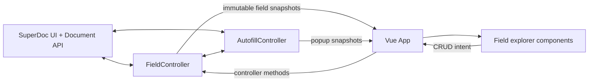

# Architecture

`FieldController` is the single source of truth for native field instances. It
loads and normalizes fields, observes external content-control changes, performs
CRUD mutations, reconciles pending creations, and publishes snapshots.

Vue derives logical groups from each instance's `tag.group` value. UI-only state
such as the selected tab and highlight toggles remains in `App.vue`.

`AutofillController` owns `{{...}}` keyboard detection, field filtering,
selection geometry, existing-field insertion, and new-field creation. Vue only
renders its popup snapshot and forwards suggestion selections.
